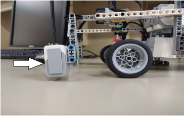

# Lego Mindstorm EV3 Autonomous Car

   

*LEGO Mindstorm EV3 Autonomous Car* with **PD Control** that **regulates velocity** depending on front distance and **stays between two white lines.**

## Contributors

This project has been done by these contributors, be sure to check them out! :

- [Doramas Báez Bernal](https://github.com/doramasma)
- [Kevin David Rosales Santana](https://github.com/kevinrosalesdev)

- [Borja Zarco Cerezo](https://github.com/BorjaZarco)

***

## Construction

Car uses two motors, one of them for a **rear-wheel drive system** and the other one for an [**Ackerman Steering Geometry**](https://mindstormspodcast.wordpress.com/2013/04/15/ackermann/) for front wheels. 

**Car Overview:**

Car contains these sensors:

- **x1 Ultrasonic Sensor:**

  

- **x2 Color Sensors:**

  

## Implementation

This project contains these files:

1. *car_project.py*: Project **Main**. You can find the **Closed-loop System Structure** and the **Learning System**.

2. *direction.py*: Car Steering File. 

   1. Class `LineSensor` returns a movement depending on **Color Sensors Values**.
   2. Class `Direction` tries to **get the car into a desired position** (Between white lines).

3. *leds.py*: Class `LED` update **LEDs Colors**.

4. *speed.py*. Car Speed File.

   1. Depending on distance, car may go in **reverse, stop or accelerate**. In last case, it will take a speed that depends on this **Sigmoid Function:**

      `(exp(0.075*x+0.3) / (exp(0.075*x + 0.01) + 4.7 )) - 0.36`

      **Sigmoid Function Plot** (Velocity [0-1] vs Distance [0-120]):

      

## Learning System

To avoid car getting on white line repeatedly, a *learning system* was designed and developed. It's about allowing the car turn **for a longer time** if it has been staying on white line many times. 

A **Speed Reduction System** was made too in these curves.

Both Systems can be found in *car_project.py*

***

**We hope you've learned some useful knowledge thanks to this Project. Thank you for visiting it!**

***
